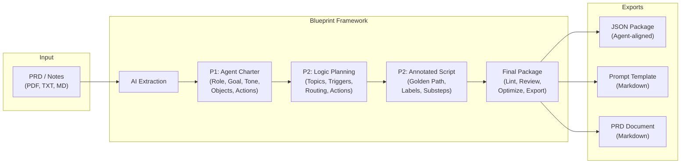

# Agent Blueprint Framework

A design-to-engineering handoff tool that helps PMs and designers author structured Salesforce Agent blueprints, then export engineering-ready packages aligned with real Agent metadata.

---

## Executive Summary

Building Agents today requires PMs and designers to bridge a significant gap between human-centered design intent and the technical metadata engineers need (Bot definitions, GenAiPlugins, Actions, Flows). This framework closes that gap.

**Agent Blueprint Framework** provides a guided, four-phase workflow where non-technical stakeholders define an agent's charter, design its logic, script its conversation flow, and produce a handoff package without writing code. LLM integration accelerates each phase by extracting structure from PRDs, generating logic plans and scripts, reviewing blueprints for completeness, and optimizing against Agent best practices.

The output is a structured JSON package, Prompt Template, and PRD — each mapped to Agent metadata types (Bot, BotVersion, GenAiPlugin, Agent Actions, ConversationVariables) — so engineering teams can implement with full confidence in the design intent.

---

## Key Features

- **PRD-to-Blueprint extraction** — Upload or paste a PRD (supports PDF, TXT, MD, JSON, RTF) and auto-extract charter fields with AI
- **Multi-topic agent modeling** — Define multiple topics per agent, each with its own triggers, routing rules, prechecks, actions, and output schema
- **LLM-powered logic planning** — Generate topic-level logic plans from the agent charter with one click
- **Annotated script editor** — Build golden-path conversation flows with 12 structured annotation labels (Trigger, Routing, Precheck, Action, Inputs, State, UI, Failure, Recovery, Guardrail, Result, Telemetry) and fallback substeps
- **Script continuation** — For complex agents, the LLM generates scripts in segments with a "continue generating" modal for flows exceeding 8 steps
- **AI review and optimization** — Score your blueprint (0-100), get actionable suggestions, and apply them automatically
- **Agent-aligned exports** — JSON package mapped to Bot/BotVersion, GenAiPlugin (Topics), Agent Actions, and ConversationVariable metadata
- **Prompt Template export** — Markdown template with system role, tools, execution rules, output format, and full conversation flow
- **PRD generation** — LLM-generated Product Requirements Document aligned with the blueprint data
- **Real-time validation** — Lint checks for missing fields, ungrounded variables, actions without fallbacks, guardrail gaps, and more
- **Collapsible multi-topic previews** — JSON, Prompt, and PRD exports render with per-topic collapsible sections

---

## Architecture Overview



---

## How It Works

### Phase 1 — Define (Agent Charter)

Define the agent's identity: role, name, user goal (JTBD), tone, jurisdiction, hard stops, system objects (nouns), system actions (verbs), guardrails, success metrics, and unhappy paths.

<!-- Replace with actual screenshot: -->
<!--  -->

### Phase 2 — Design (Logic Planning)

Create one or more topics. For each topic, define triggers, routing rules, prechecks, action inventory, output schema, and fallback rules. Use "Generate with AI" to auto-populate from the charter.

<!-- Replace with actual screenshot: -->
<!--  -->

### Phase 2 — Design (Annotated Script)

Build the golden-path conversation flow step by step. Each step has an actor (User/Agent/System), dialogue text, and up to 12 structured annotation labels. Add fallback substeps for any step with an Action label. Use "Generate with AI" for full script generation with continuation support.

<!-- Replace with actual screenshot: -->
<!--  -->

### Final Package (Agent Handoff)

Review the handoff checklist, run AI review (scored 0-100 with strengths/suggestions/missing items), optimize with AI, configure Action Specs (implementation type, inputs/outputs, fallbacks), and export.

<!-- Replace with actual screenshot: -->
<!--  -->

---

## Getting Started

### Prerequisites

- Node.js 18+
- npm
- An OpenAI API key (for LLM features)

### Install and Run

```bash
git clone https://github.com/yuhakim-ux/agent-blueprint.git
cd agent-blueprint
npm install
npm run dev
```

Open http://localhost:5173 in your browser.

### Set Up the OpenAI API Key

1. Click the gear icon in the top-right corner of the app
2. Enter your OpenAI API key — it is stored in `localStorage` (never sent to any server other than OpenAI)
3. Select a model (default: `gpt-4o-mini`)
4. The badge should turn green ("Key set")

---

## Project Structure

```
src/
├── AgentBlueprint.jsx      # Main React component — all UI, state, and LLM handler logic
├── llm-service.js           # OpenAI API integration (extract, logic, script, review, optimize, PRD)
├── handoff-helpers.js       # Pure functions: lint/validation, JSON export, Prompt Template builder
└── components/ui/           # shadcn/ui primitives (Button, Card, Tabs, Select, ScrollArea, etc.)
```

| File | Responsibility |
|------|---------------|
| `AgentBlueprint.jsx` | UI components, state management, multi-topic editing, script continuation modal |
| `llm-service.js` | `callLLM` / `callLLMMultiTurn`, task-specific prompts and parsers for 6 LLM functions |
| `handoff-helpers.js` | `lintHandoff()`, `buildAgentHandoffPackage()`, `buildPromptTemplate()`, action spec defaults |

---

## Export Formats

### JSON Package

Structured JSON mapped to Agent metadata:

| JSON Field | Maps To |
|-----------|---------|
| `agent_definition` | Bot / BotVersion metadata |
| `topics[].topic_configuration` | GenAiPlugin (Agent Topic) |
| `topics[].action_specs[]` | Agent Action |
| `topics[].conversation_variables` | BotVersion ConversationVariable |
| `topics[].conversation_flow` | Golden-path steps with labels |
| `guardrails_and_policy` | Trust & safety rules |
| `telemetry` | Success metrics and recommended events |

### Prompt Template

Markdown document with sections: Design Intent, System/Role, Tools, Topic Instructions, Execution Rules, Output Format (Console), and Conversation Flow with variable maps.

### PRD (Product Requirements Document)

LLM-generated Markdown PRD with: Overview, User Stories, Scope, Functional Requirements, Data Objects, Non-Functional Requirements, Acceptance Criteria, Telemetry, and Topic Matrix.

---

## Roadmap

- Agent compatibility scorecard with structured lint findings
- Design intent trace panel (source field to export field mapping)
- Inline Agent mapping badges in Charter / Logic / Script tabs
- Pre-export diff checks between authored intent and serialized outputs
- Harmonized copy referencing topic/action mapping identifiers

---

## Tech Stack

| Layer | Technology |
|-------|-----------|
| Framework | React 19 |
| Build | Vite 7 |
| Styling | Tailwind CSS 4 |
| Components | shadcn/ui (Radix primitives) |
| Icons | Lucide React |
| LLM | OpenAI API (client-side, user-provided key) |
| PDF Parsing | pdfjs-dist |

---

## License

Internal prototype — not yet licensed for external distribution.
